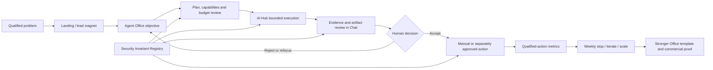

# Eclipse Forge OS operating plan

## Purpose

This is the execution map for turning Eclipse Forge from a portfolio of strong projects
into one understandable and commercially testable system. It connects product delivery,
security, acquisition and revenue without pretending that unfinished integrations or
unvalidated demand already exist.

North-star outcome:

> A technical founder or product owner submits one bounded objective, watches an AI
> office produce evidence-backed work, accepts or rejects the artifact, and takes one
> measurable next action without losing control of data, cost or external effects.

The first business proof is not “many agents” or “many posts”. It is one accepted Growth
Office artifact that leads to a qualified audit, demo, repository or implementation
action and whose cost and review effort are known.

## Current position

The program already has important working foundations:

- Eclipse Chat owns tenant-scoped Growth and Builder review rooms, human decisions and
  approval reset at trust boundaries.
- Eclipse AI Hub owns bounded Growth roles, one-step execution, timeout/cancel, per-user
  budgets and reviewed Builder artifacts.
- Builder files use exact allowlisted dependencies and have an offline verifier.
- Landing defines the flagship, business model, audiences and conversion direction.
- Sentinel has guarded read-only capabilities; Media remains a reviewed artifact plane.

The material gaps are:

- no platform-wide Security Invariant Registry or maintained risk register;
- no accepted end-to-end Growth run with attributable business measurement;
- no analytics baseline and stable UTM contract;
- no packaged AI Opportunity Audit with explicit scope and acceptance criteria;
- no repeat-use evidence for a second Office or recurring platform pricing;
- no production connector that has passed data, permission, retention and rollback gates.

## The whole system



### Product planes

| Plane | Product | Owns | Does not own |
| --- | --- | --- | --- |
| Acquisition | Eclipse Forge Landing | Positioning, proof, lead magnets, funnels | Agent execution or customer secrets |
| Control | Eclipse Chat | Workspaces, rooms, review, approvals, run presentation | Provider credentials or arbitrary shell execution |
| Execution | Eclipse AI Hub | Models, roles, budgets, cancellation, tool policy | Workspace membership or final business approval |
| Evidence | Eclipse Library | Sources, provenance, contradictions, approved snapshots | Publication or production mutation |
| Local capability | Hopson Sentinel | Paired-node capabilities and local receipts | Standing remote authority |
| Artifact | Eclipse Media / Shotforge / HyperFrames | Reviewed render jobs, previews and exports | Unapproved distribution |

The products remain independently deployable. Eclipse Forge OS is their contract and
experience layer, not a shared database or forced monolith.

## Two journeys that must stay connected

### Customer journey

```text
Useful public proof
  -> checklist or express diagnostic
  -> AI Opportunity Audit
  -> productized implementation pilot
  -> recurring Office workflow
  -> managed or self-hosted platform
```

### Product journey

```text
Objective
  -> reviewed plan and risk signals
  -> bounded run
  -> evidence and artifact
  -> independent human decision
  -> measured outcome
  -> template improvement
```

An acquisition experiment without a target Office becomes content activity. An Office
without a buying path becomes a portfolio demo. Both journeys must reference the same
audience, problem, offer, CTA and measurable result.

## Operating workstreams

| Workstream | Purpose | Current priority | Owner |
| --- | --- | --- | --- |
| Trust and governance | Risk register, invariants, secrets, dependency and connector gates | P0 | Pavel + platform engineering |
| Growth Office proof | Complete one accepted and measured positioning-audit workflow | P0 | Growth OS owner |
| Commercial packaging | Convert proof into AI Opportunity Audit and implementation offers | P0 | Pavel / product marketing |
| Distribution and measurement | Manual Threads/build-in-public loop, UTM and weekly decisions | P1 | Growth owner |
| Office expansion | Extract Research or Builder Office only from repeated paid demand | P2 | Product owner |
| Platform distribution | Connectors, managed/self-hosted tiers and template ecosystem | P3 | Platform + security owner |

## Security operating model

### Assessment scope and model

- **Purpose:** support product and release decisions for Eclipse Forge OS.
- **Scope:** Landing, Chat, AI Hub, Library, Sentinel and Media contracts involved in an
  Agent Office run. Star CRM is explicitly out of scope.
- **Risk tier:** NIST SP 800-39 Tier 3 system assessment, informing the Tier 2 Eclipse
  Forge product mission.
- **Method:** qualitative NIST SP 800-30 factors: threat source, threat event,
  vulnerability/predisposing condition, likelihood, impact and residual risk.
- **Scale:** Very Low, Low, Moderate, High, Very High using the documented NIST 5×5
  reference matrix.
- **Constraints:** this is an architecture- and repository-evidence assessment, not a
  penetration test. Scores are provisional until runtime evidence or incidents update
  likelihood.

### Lethal Trifecta gate

Every Office and connector declares three independent signals:

1. access to private data;
2. access to untrusted content;
3. agent-directed external communication.

If all three are true, execution is blocked. A prompt warning or generic approval cannot
override the gate. The architecture must remove at least one capability or split the
workflow into independently authorized components.

Mutation, persistent memory and production access are additional risk multipliers. They
do not make the trifecta safe when one of the three primary signals remains hidden.

### Provisional risk register

| ID | Threat event | Key condition | Likelihood | Impact | Inherent risk | Treatment | Current residual | Owner |
| --- | --- | --- | --- | --- | --- | --- | --- | --- |
| EF-R01 | Injected content causes an agent to expose workspace or service secrets | Plaintext-secret debt plus future retrieval/tool access | Moderate | Very High | High | Mitigate: vault, rotation, context exclusion, no agent-directed egress | High outside current public-only Growth slice | Pavel / platform |
| EF-R02 | External page, document or tool metadata hijacks a plan or action | Untrusted content reaches a privileged agent | High | High | High | Avoid trifecta; pin tools; separate policy enforcement from model output | Low in no-tools Growth; unassessed for future connectors | AI Hub / Sentinel |
| EF-R03 | Hallucinated or substituted dependency enters generated code | AI-generated package name plus registry install | Moderate | High | Moderate | Exact allowlist, provenance, integrity, lockfile, advisory and lifecycle-script gates | Low for Builder v1; Moderate portfolio-wide | Builder owner |
| EF-R04 | Upstream or cross-tenant approval is treated as execution authority | Shared artifacts and asynchronous review | Moderate | Very High | High | Reset approval, tenant authz, exact version/hash, expiry and replay protection | Moderate pending full end-to-end verification | Chat owner |
| EF-R05 | Later agent refactor removes a security control while tests remain superficially green | Locally optimized task and missing negative tests | High | High | High | Versioned invariants, abuse-case regression tests and review of test weakening | Moderate | Repository owner |
| EF-R06 | Agent loop consumes unbounded model/tool budget | Retry, recursion or adversarial input | Moderate | Moderate | Moderate | Per-run/user budgets, timeout, cancellation and tool-chain ceilings | Low in Growth executor | AI Hub owner |

Risk acceptance must name the owner, evidence, expiry and residual risk. “The model is
better now” is not treatment evidence.

### Security Invariant Registry

Every executable Office version must provide a `security.invariant.v1` artifact with:

- scope, owner and assessment date;
- lethal-trifecta signals and execution decision;
- enforceable invariants with evidence and negative test IDs;
- threat events, treatment and residual risk;
- reassessment triggers;
- independent review before `approved` status.

The contract and first Growth fixture live in [security](security). The fixture is a
design record, not proof that every runtime path has passed the controls.

## Delivery stages

### Stage 0 — Control the foundation (now, days 1–7)

Deliverables:

- versioned Security Invariant Registry and first Growth Office fixture;
- current risk register with named owners and unresolved conditions;
- UTM taxonomy and `not_available` analytics baseline;
- one bounded positioning-audit objective and evidence set;
- documented AI Opportunity Audit scope draft.

Exit gate:

- no Critical or unowned High risk in the selected Growth workflow;
- Growth run can be stopped and cannot publish, mutate production or access secrets;
- owner can explain the objective, cost ceiling, evidence and next action.

### Stage 1 — Prove one useful Office (days 8–30)

Deliverables:

- one accepted Growth Office artifact from a real Eclipse Forge product;
- one sanitized observable-run demonstration;
- Production Readiness lead magnet and measured landing funnel;
- packaged AI Opportunity Audit with inclusions, exclusions, acceptance criteria and CTA;
- manual Threads signal experiment with no OAuth or autopublishing;
- weekly review recording stop, iterate or scale.

Exit gate:

- at least one qualified action is attributable to the funnel, or the experiment is
  explicitly stopped;
- artifact evidence quality, human editing time and execution cost are known;
- no fabricated claims or external action without exact approval.

### Stage 2 — Prove repeatability and willingness to pay (days 31–60)

Deliverables:

- three calibrated Growth runs using the same contract;
- one bounded design-partner or productized implementation pilot;
- weekly decision log and qualified-action metrics visible in Chat;
- contribution calculation including model, infrastructure and human review time;
- decision between Research Office and Builder Office based on observed demand.

Exit gate:

- the workflow repeats without custom architecture each time;
- scope and acceptance criteria survive a real buyer conversation;
- recurring use is plausible from evidence, not feature enthusiasm.

### Stage 3 — Add the second wedge (days 61–90)

Deliverables:

- one second Office built from shared primitives;
- one reviewed read-only connector only if it is required by the proven workflow;
- connector manifest, metadata hash, auth scope, retention, deletion and rollback record;
- pricing experiment based on accepted runs/offices, not decorative agent seats.

Exit gate:

- shared platform primitives reduce delivery effort;
- connector does not create the lethal trifecta;
- the second Office has a distinct buyer, problem and paid pull.

### Stage 4 — Platform expansion (after day 90)

Only after recurrence evidence:

- managed workspace subscription;
- self-hosted/private deployment;
- verified templates and connector packs;
- partner implementation model.

No open agent marketplace, standing authorizations or autonomous distribution is
introduced merely to make the platform appear larger.

## Program scoreboard

| Level | Metric | Why it matters |
| --- | --- | --- |
| Business | Qualified audits, demos and implementation requests | Proves demand better than impressions |
| Conversion | Lead-magnet and landing CTA conversion | Connects distribution to a buying path |
| Product | Accepted artifact rate and second completed run | Measures useful and repeated work |
| Quality | Primary-source coverage and rejected unsupported claims | Prevents polished misinformation |
| Efficiency | Human editing time and total cost per accepted artifact | Tests unit economics |
| Safety | Unowned High risks and unauthorized external actions | Must trend to zero |
| Reliability | Cancellation success, timeout and failed-run recovery | Proves operator control |

Missing values are `not_available`, never estimated. Each weekly review chooses one
highest-value action and one stop condition.

## Responsibility model

| Decision | Accountable | Evidence producer | Independent reviewer |
| --- | --- | --- | --- |
| Product priority and accepted risk | Pavel | Product/engineering owner | Security review |
| Office contract and model/tool policy | AI Hub owner | Executor tests and telemetry | Chat/control-plane owner |
| Artifact acceptance and external action | Named workspace human | Agent Office | Separate policy/execution gate |
| Source and claim quality | Library/Growth owner | Research and Claim Auditor | Human editor |
| Publication and campaign result | Pavel/Growth owner | Distribution preview and analytics | Weekly review |
| Connector activation | Platform owner | Scope, retention, deletion and rollback evidence | Security owner |

## Start here: next 72 hours

1. Accept this operating plan as the program source of truth.
2. Review the first Growth `security.invariant.v1` fixture and assign owners to EF-R01–R06.
3. Keep EF-R01 open until plaintext secrets are vaulted and potentially exposed values
   are rotated; do not index those paths.
4. Choose one real positioning-audit objective: Eclipse Forge OS itself is the default.
5. Capture the current analytics baseline, using `not_available` where tracking is absent.
6. Run the bounded Growth workflow and review one artifact; do not publish it.
7. Use the accepted/rejected result to finalize the AI Opportunity Audit offer and first
   landing experiment.

## Prioritized implementation backlog

| Priority | Size | Item | Dependency | Risk | Next action |
| --- | --- | --- | --- | --- | --- |
| P0 | S | Review Security Invariant Registry and Growth fixture | This plan | Paper controls mistaken for runtime proof | Map each invariant to an existing or missing test |
| P0 | M | Resolve EF-R01 secret exposure condition | User-owned vault and rotation decision | Credentials remain reachable by local agents | Inventory names/locations without reading values; produce rotation checklist |
| P0 | S | Capture analytics and UTM baseline | Landing access | Missing attribution | Record current tools and `not_available` metrics |
| P0 | M | Complete one positioning-audit run | Public Eclipse evidence | Output has no business action | Fix one audience, offer and CTA before execution |
| P0 | M | Package AI Opportunity Audit | Accepted/rejected run evidence | Unbounded consulting scope | Define exact inputs, deliverable, exclusions and acceptance |
| P1 | M | Add security invariant validation to AI Hub | Approved contract | Schema exists but runtime ignores it | Reject execution when trifecta gate is blocked |
| P1 | M | Add invariant and risk review to Chat | AI Hub validation | Review becomes decorative | Reset approval and show exact signals/evidence |
| P1 | M | Add dependency provenance snapshot | Registry access and policy | Stale or malicious package evidence | Pin source, version, integrity and freshness |
| P1 | M | Add weekly decision log and qualified metrics | Measurement contract | Content volume replaces outcomes | One stop/iterate/scale record per week |
| P2 | L | Extract Research or Builder Office | Repeat use or paid pull | Premature platform breadth | Choose only after Stage 2 evidence |
| P3 | XL | Managed/self-hosted commercial tiers | Recurrence and support model | Operational burden exceeds revenue | Validate willingness to pay first |

## Evidence references

- [NIST SP 800-30 Rev. 1](https://csrc.nist.gov/pubs/sp/800/30/r1/final)
- [OWASP AI Agent Security Cheat Sheet](https://cheatsheetseries.owasp.org/cheatsheets/AI_Agent_Security_Cheat_Sheet.html)
- [The lethal trifecta for AI agents](https://simonwillison.net/2025/Jun/16/the-lethal-trifecta/)
- [USENIX Security 2025 package hallucination study](https://www.usenix.org/conference/usenixsecurity25/presentation/spracklen)
- [Understanding the (In)Security of Vibe-Coded Applications](https://arxiv.org/abs/2606.23130)
